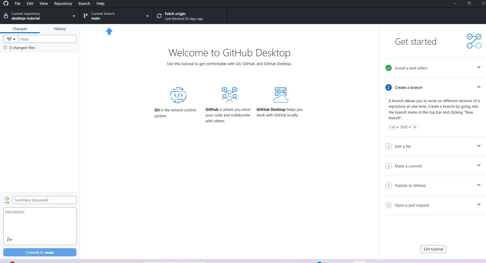

# Práctica 1: "Instalación y Funcionamiento de los Entornos Móviles"

## Integrantes

- González Rodríguez Zoe - [ZoeGR14](https://github.com/ZoeGR14)
- Quintanar Bravo Jacqueline Williams - [WilliamsZeppelli](https://github.com/WilliamsZeppeli)
- Vázquez Hernández Michel - [Jimmysito316](https://github.com/Jimmysito316)
- Vazquez Segura Brandon - [PandaKiller05](https://github.com/PandaKiller05)

## Ejercicio 1: Instalación de Herramientas

### Capturas Zoe

1. Android Studio

2. GitHub Desktop

3. Docker

### Capturas Jacqueline

1. Android Studio
   
1. Docker
   
1. GitHub Desktop
   

### Capturas Michel

1. **Android Studio**
   

2. **GitHub Desktop**
   

### Capturas Brandon
1. Android Studio
   
2. Docker
   
3. GitHub Desktop
   

## Ejercicio 2: Navegación Creativa

### Descripción de Activities

- MainActivity: PC Michel Vazquez Hernandez
  MainActivity: Es el punto de entrada de la aplicación. Su función principal es servir como base para el primer nivel de navegación y contener el botón de acceso al siguiente nivel.

FragmentGabinete: Es un componente modular que muestra la vista global del sistema (Gabinete). Contiene la información visual del hardware externo y se carga dinámicamente al iniciar la app.

- SecondActivity: MotherBoard

- ThirdActivity: CPU

- FourthActivity: ALU

### Manejo de transiciones y ciclo de vida

Vazquez Michel
-Para manejar las transiciones, utilizamos un Intent explícito que permite la navegación entre MainActivity y SecondActivity. Al presionar el botón, la actividad actual entra en estado onPause() y onStop(), mientras que la nueva actividad inicia su ciclo con onCreate() y onStart(). El uso de un Fragment permite que la interfaz sea más eficiente, ya que no se recrea toda la pantalla, solo se reemplaza el contenedor mediante un FragmentTransaction."

### Instrucciones de ejecución
Clonar el repositorio desde GitHub.

Abrir el proyecto en Android Studio (asegúrarse de tener instalada la versión Jellyfish o superior).

Sincronizar el proyecto con los archivos de Gradle.

Ejecutar en un emulador con API 34 o superior, o conectar un dispositivo físico mediante Depuración USB.

### Capturas de Programa Funcional

## Ranking de Computadoras

### 🥇

### 🥈

### 🥉
Huawei 14T Intel Core I5 11th
