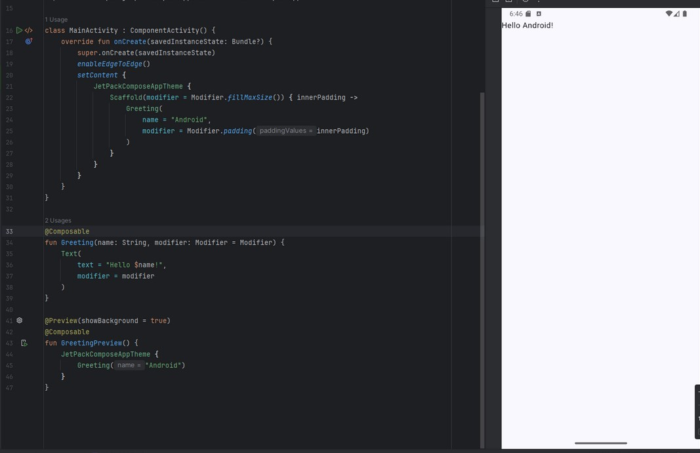
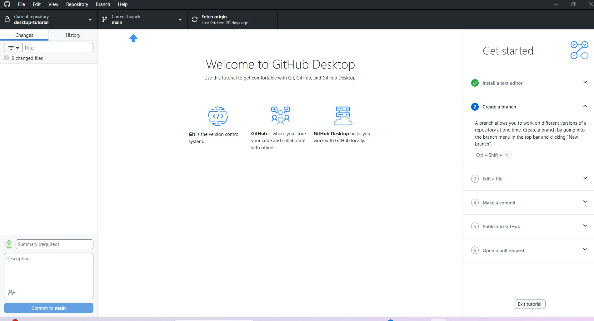
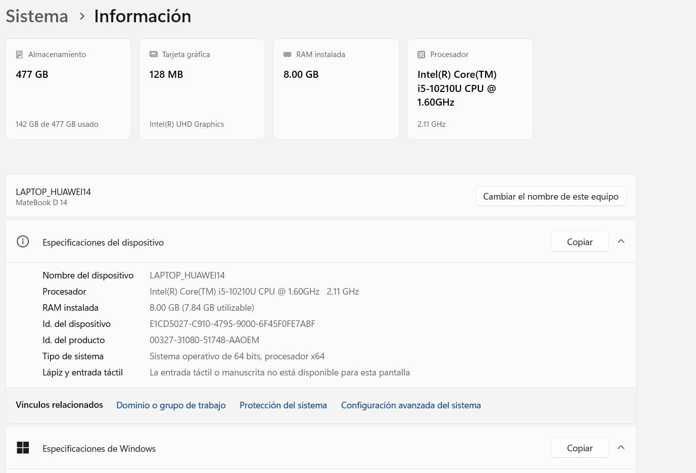

# Práctica 1: "Instalación y Funcionamiento de los Entornos Móviles"

## Integrantes

- González Rodríguez Zoe - [ZoeGR14](https://github.com/ZoeGR14)
- Quintanar Bravo Jacqueline Williams - [WilliamsZeppelli](https://github.com/WilliamsZeppeli)
- Vázquez Hernández Michel - [Jimmysito316](https://github.com/Jimmysito316)
- Vazquez Segura Brandon - [PandaKiller05](https://github.com/PandaKiller05)

   
## Ejercicio 1: Instalación de Herramientas

📸 Ver capturas

   
### Capturas Zoe

1. Android Studio

2. GitHub Desktop

3. Docker

### Capturas Jacqueline

1. Android Studio

   

2. Docker

   

3. GitHub Desktop

   

### Capturas Michel

1. **Android Studio**

   

2. **GitHub Desktop**

   

### Capturas Brandon

1. Android Studio

   

2. Docker

   

3. GitHub Desktop

   

## Ejercicio 2: Navegación Creativa

### Descripción de Activities

#### MainActivity: PC Michel Vazquez Hernandez

MainActivity: Es el punto de entrada de la aplicación. Su función principal es servir como base para el primer nivel de navegación y contener el botón de acceso al siguiente nivel.
FragmentGabinete: Es un componente modular que muestra la vista global del sistema (Gabinete). Contiene la información visual del hardware externo y se carga dinámicamente al iniciar la app.

#### SecondActivity: MotherBoard

Es la segunda pantalla de la aplicación y está dedicada al nivel intermedio de la arquitectura de hardware: la Tarjeta Madre. Su propósito es explicar al usuario cómo este componente actúa como el "sistema nervioso" de la computadora, permitiendo la conectividad y distribución de datos entre elementos esenciales como la RAM, el almacenamiento y los puertos de expansión.

La interfaz se divide en secciones principales para facilitar la lectura:

Barra de título: Un contenedor (LinearLayout) con fondo de color azul (#5C73B8) que muestra el título principal "Tarjeta Madre" y el subtítulo "El Sistema Nervioso de la PC".

Contenido educativo (GamasMoboFragment): Un área navegable mediante un ScrollView que incluye una imagen representativa y el texto explicativo de conectividad. Dentro de esta sección se encuentra un FragmentContainerView que aloja de forma estática al GamasMoboFragment, el cual detalla la clasificación de las placas base según su gama de chipset (Entrada, Media y Alta). Al final de la vista, se ubica el botón Inspeccionar el Socket del CPU para ejecutar el Intent y avanzar a la tercera pantalla del sistema.

#### ThirdActivity: CPU

#### FourthActivity: ALU y Transistores

Es la cuarta pantalla de la aplicación y está dedicada al tema educativo "ALU y Transistores — El nivel atómico de la computación". Su propósito es presentar al usuario información sobre la Unidad Aritmético-Lógica (ALU), las compuertas lógicas y los transistores que componen los procesadores modernos.

La interfaz se divide en dos secciones principales:

- **Barra de título**: Un ConstraintLayout con fondo de color (#5C72B8) que muestra el título "ALU y Transistores" y el subtítulo "El nivel atómico de la computación".
- **Contenido educativo** (`FourthFragment`): Un FragmentContainerView que aloja de forma estática al FourthFragment. Este fragmento contiene un ScrollView con imagenes representativas, texto explicativo y el botón de `Regresar` para volver a la pantalla principal

### Manejo de transiciones y ciclo de vida
Para lograr una experiencia fluida y eficiente, el sistema utiliza dos mecanismos principales de Android:
Transiciones mediante Intent Explícito

El flujo entre los niveles principales (como pasar del Gabinete a la Tarjeta Madre) se gestiona mediante objetos Intent explícitos. Esto garantiza una navegación directa y segura hacia las actividades destino. Al realizarse esta transición:

- La actividad de origen entra en estado onPause() y onStop(), liberando recursos de interfaz.

- La actividad de destino inicia su ciclo de vida con onCreate(), onStart() y onResume(), cargando los componentes necesarios para ese nivel jerárquico.

  Optimización mediante Fragments

Dentro de las actividades, se implementó el uso de Fragments para modularizar la interfaz. Esto permite:

Eficiencia de memoria: No es necesario recrear toda la ventana de la aplicación; solo se reemplaza el contenido del contenedor mediante un FragmentTransaction.

Modularidad: Cada nivel de la jerarquía puede actualizar su contenido visual de forma independiente, facilitando la integración de datos técnicos y gráficos específicos.  

### Instrucciones de ejecución

1. Clonar el repositorio desde GitHub.
2. Abrir el proyecto en Android Studio (asegúrarse de tener instalada la versión Jellyfish o superior).
3. Sincronizar el proyecto con los archivos de Gradle.
4. Ejecutar en un emulador con API 34 o superior, o conectar un dispositivo físico mediante Depuración USB.

### Capturas de Programa Funcional

## Ranking de Computadoras

📸 Ver ranking

### 🥇 Top 1

### 🥈 Top 2: PC Ryzen 5 5600X + RTX 3060

### 🥉 Top 3: Huawei 14 Intel Core Ultra 5

### Top 4: Huawei 14T Intel Core i5 10th

